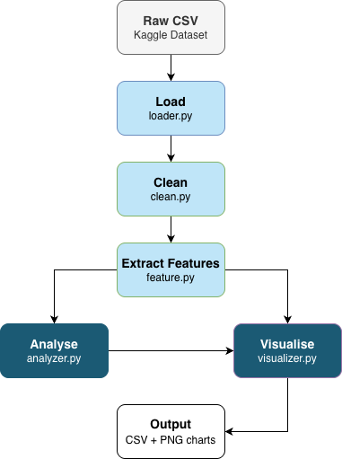

# Pipeline Builders
# DATA2005 Team Data Processing Project - [Web Data]

**Course:** DATA 2005 - Data-Centric Programming  
**Assessment:** Team Data Processing Project (20%)

## Team Members

| Name | Role | GitHub |
|------|------|--------|
| [Nada Abassi] | Data Engineer | [@nadaaa72] |
| [Monike Ozeias Santos] | Data Analyst | [@monikeoz] |
| [Hania Amear] | Visualization Lead | [@haniaamear25] |
| [Lea Stanisavljevic] | Documentation Lead | [@bytelea] |

## Project Description

This project analyses web-based job market data using a dataset of Data Analyst job postings collected from Google Search results. The aim is to explore trends in salaries, required skills, job locations and benefits. The project applies a full data processing pipeline including data loading, cleaning, transformation, analysis and visualisation using Python tools. The goal is to extract meaningful insights about the current demand in the data analyst job market.

## Dataset

- **Name:** Data Analyst Job Postings [Pay, Skills, Benefits]
- **Source:** https://www.kaggle.com/datasets/lukebarousse/data-analyst-job-postings-google-search
- **Size:** ~10,000+ records
- **Format:** CSV

## Project Structure
```
data2005_team_project/
|-- data/
|   └──processed/
|      |-- company_name.csv
|      └── job_count.csv
|-- src/
|   └── pipeline
|       |-- __init__.py
|       |-- analyzer.py
|       |-- cleaner.py
|       |-- exporter.py
|       |-- features.py
|       |-- loader.py
|       |-- pipeline.py
|       |-- validator.py
|       └── visualizer.py
|-- tests/
|   └── test_pipeline.py
|-- run.py
|-- conftest.py
|-- requirements.txt
|-- .gitignore
|-- LICENSE
└── README.md
```

## How to Run
1. Install dependencies:
pip install -r requirements.txt

2. Run the full pipeline:
python run.py


## Data Pipeline


Raw CSV -> Load -> Clean -> Extract Features -> Analyse -> Visualise -> Export

## Data Engineering (Nada)
As the data engineer, Nada set up the project structure and built the core processing modules that the entire pipeline depends on.

### Key Work Performed
- **Project Setup**
  - Designed the overall pipeline architecture so all modules connect and run via `python run.py`

- **Data Cleaning** (`cleaner.py`)
  - Removed duplicate rows from the dataset
  - Stripped extra whitespace from text columns
  - Filled missing salary values with the column median
  - Parsed the skills column from raw text strings into Python lists

- **Feature Engineering** (`features.py`)
  - Extracted year and month from date columns for time-series analysis
  - Split location strings ("New York, NY") into separate city and state columns
  - Classified job titles into seniority levels: junior, mid, senior, and lead

### Tools & Techniques Used
- **Pandas** for data manipulation and column operations
- **Regex** for parsing location and zip code strings
- **ast.literal_eval** for safely converting skill strings to lists

## Data Analysis (Monike)
As the data analyst, Monike was responsible for extracting meaningful insights from the cleaned dataset using Python, primarily with Pandas and NumPy.

### Key Analysis Performed
- **Top Companies Hiring**
  - Identified companies with the highest number of job postings using frequency analysis (Upwork, Talentify.io and Walmart were among the top recruiters)

- **Top Job Locations**
  - Analysed the most common job locations across the dataset
  - A large proportion of roles were listed as "Anywhere" or "United States", indicating a strong presence of remote positions

- **Top Job Titles**
  - Extracted the most frequent job roles using value counts
  - "Data Analyst" and "Senior Data Analyst" were the most common roles

- **Remote Work Analysis**
  - Calculated the percentage of remote jobs using the `work_from_home` column (nearly all jobs in the dataset were remote)

- **Skill Demand Analysis**
  - Performed feature extraction on job descriptions to detect in-demand technical skills (Excel and SQL were the most frequently requested skills, followed by Python, Tableau and Power BI)

- **Statistical Insight**
  - Used NumPy to compute summary statistics such as average job title length

### Tools & Techniques Used
- **Pandas** for data manipulation, aggregation and analysis
- **NumPy** for statistical computations
- **Vectorised operations** (`value_counts()`, `.mean()`, `.sum()`)
- **Text-based feature extraction** using `str.contains()`

## Visualisations (Hania)
As the visualisation lead, Hania was responsible for creating all charts and graphs that communicate the project's findings visually.

### Charts Produced

- **Top Companies by Job Postings**
  - Vertical bar chart showing the companies with the highest number of job listings

- **Top Job Titles (Lollipop Chart)**
  - Visual representation of the most common job roles, using a lollipop chart for clearer comparison

- **Top Job Locations**
  - Bar chart highlighting locations with the highest number of postings, including an average reference line to identify >average regions

- **Skill Demand (Bar + Donut Chart)**
  - Combined visualisation showing:
    * absolute demand for each skill (bar chart)
    * relative percentage share (donut chart)

- **Role Distribution by Company (Stacked Bar Chart)**
  - Shows how different companies distribute hiring across top job roles.
Each company is normalised to 100%, allowing fair comparison of hiring focus.

### Tools & Techniques Used

- **Seaborn** for styled statistical charts using the `whitegrid` theme
- **Matplotlib** for figure creation, layout and saving charts as PNG files
- **Pandas DataFrames**
Used to manipulate and transform analysed data for visualisation
  
**Chart Design Techniques**
  - Data normalisation (percentage conversion for fair comparison
  - Combined charts (bar + donut) to show both scale and proportion
  - Highlighting (e.g. above-average values)
  - Label annotations for clarity and readability

## Documentation (Lea)
As the documentation lead, Lea was responsible for maintaining clear and organised project documentation throughout.

- Created and set up the GitHub repository for the team, including initial folder structure, `.gitignore` and `LICENSE`
- Delegated tasks and team member roles to best fit each person
- Wrote and maintained the README, documenting each team member's contributions
- Produced the data pipeline diagram showing the flow from raw data to final output
- Ensured the code structure was clearly described and navigable for anyone running the project
- Created and designed the powerpoint presentation
- Ensured all consistent comments throughout the code
